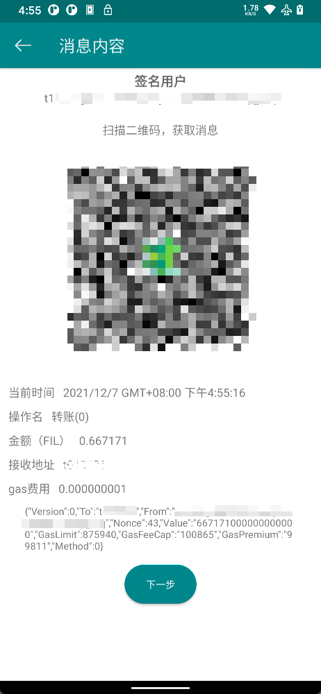

# 基本使用

## 导入

- **钱包名称**：需要导入的钱包的名称，可选，默认为钱包地址前10位
- **钱包地址**：需要导入的钱包地址
- **清空**：清空钱包地址输入框
- **粘贴**：粘贴剪贴板内容到钱包地址输入框
- **扫描**：扫描其他人分享的二维码得到钱包地址

你只需要输入你的钱包地址(ID或公钥地址),然后点击确定按钮就可以将钱包轻松导入到热钱包。进行变更owner等重要操作时，必须要首先导入钱包才能选择地址。

## 收款

- **复制**：复制钱包地址到剪贴板
- **分享**：分享二维码到其他app

点击收款按钮后会弹出一个二维码，二维码内容为当前钱包的地址，你可以复制地址的链接，或者将二维码通过聊天软件分享给他人以用于收款。

## 钱包列表

展示已经导入的所有钱包，按照存储提供者-多签-普通的顺序进行排序
长按钱包可以删除或修改钱包名称

## 消息处理

- **签名用户**：需要对本条消息进行签名的钱包地址，
- **操作名**：当前操作的名称
- **金额**：转账金额
- **接收地址**：接收方地址，可能是收款人、矿工钱包的owner地址、多签变更中的多签钱包地址等
- **gas费用**：需要花费的gas费用，单位为FIL

### 消息处理流程：

- 进入消息内容页面
- 使用冷钱包扫描二维码签名
- 点击下一步，扫描冷钱包生成的二维码
- 确认信息无误后点击发送即可发送消息
- 点击发送按钮后即可进入消息发送界面，等待消息上链成功后返回。

在第一步请求发起之后，您会进入一个消息处理页面，此时页面会展示一个二维码，此时需要打开冷钱包，点击签名按钮，扫描屏幕上的二维码进行签名。

::: warning 警告
在进行签名和发送消息前一定要确认好消息内容，以防造成财产损失。
:::

你可以在消息发送界面等待消息上链成功（大概需要60s时间），或者直接返回（不建议）。

::: tip 注意
如果在发送消息时候出现发送失败的情况，一般是由于gas费用不足或nonce错误，您可以返回上一步重新构建消息。
:::

## 交易记录

在钱包详情页面，点击顶部的卡片，即可跳转到交易记录按钮，该页面包含了您在**本应用中**所有和当前钱包相关的交易记录。如果之前有记录发送后未在交易处理页面等待，也可进入该页面查看该交易是否成功，交易成功的消息以**绿色图标**表示。您可以在设置中删除所有交易记录。
