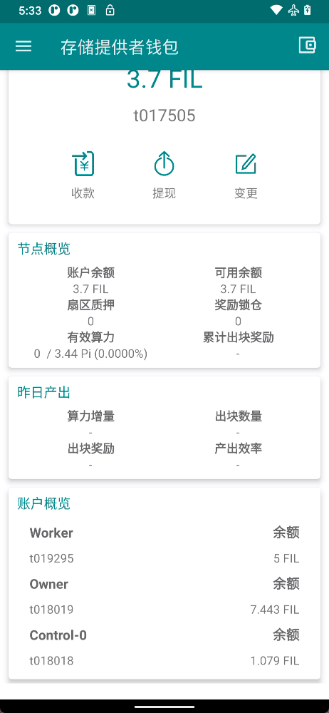
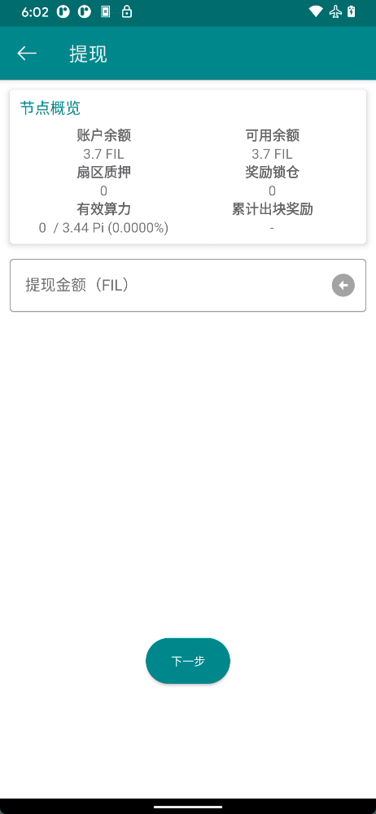
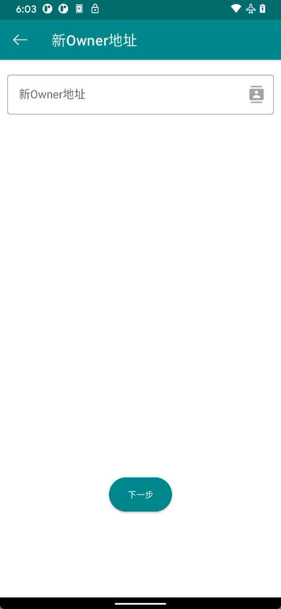
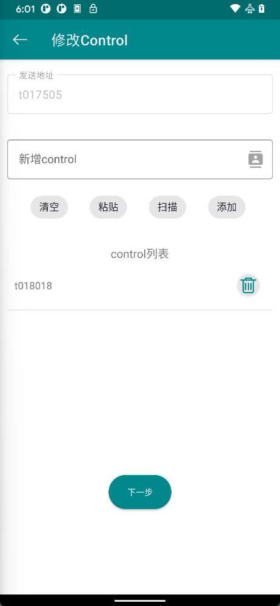

# 存储提供者

存储提供者钱包是fileCoin存储节点对应的钱包，可以展示节点算力，出块奖励等信息。出块奖励会发给存储提供者钱包账号。

## 存储提供者钱包

- **节点概览**：存储提供者节点的信息
  - **账户余额**： 当前账户所有余额
  - **账户余额**： 当前账户可用余额
  - **扇区质押**：质押金额
  - **奖励锁仓**：锁定中出块奖励
  - **有效算力**：当前节点实际提交的算力
  - **累计出块奖励**：累计出块奖励

- **昨日产出**：该节点昨日数据(暂未提供)
- **账户概览**：该存储提供者节点下的工作账号
 - 存储提供者钱包的拥有者，拥有对该钱包的控制权
 - worker地址用于发送和支付存储提供者节点执行的日常操作
 - Control 地址用于向链提交WindowPoSts证明，可以有多个

## 提现

如果需要使用存储提供者钱包的余额，可以点击提现按钮，将其转出到owner钱包，提现操作不需要gas费，你可以点击输入框右边的按钮，全部提出余额。如果钱包的owner是多签钱包，您还需要选择签名人进行签名，并在多签钱包里确认交易。

点击下一步，即可进入[消息处理](../guide/basic.md#消息处理)环节。

## 修改Owner

Owner是存储提供者钱包的拥有者，拥有对该钱包的控制权，如果您当前钱包Owner是普通钱包，我们建议将其更改为[多签钱包](../guide/msig.md)，以提高账号安全性。将owner修改为多签地址后，后续无需变更owner，只需对多签地址签名人进行变更，即可完成对存储提供者钱包拥有者的变更。

修改owner请求完成之后，还需要使用新的owner地址进行确认，只需要点击<待确认变更>里面的消息，继续确认即可。

点击下一步，即可进入[消息处理](../guide/basic.md#消息处理)环节。

## 修改worker

worker地址用于发送和支付存储提供者节点执行的日常操作。

修改worker地址同样需要两次确认，在发起修改完成后，你需要等待节点进入修改worker状态，然后再次使用owner地址确认worker变更。与修改owner相同，无需手动创建确认消息，只需要在<待确认变更>里点击对应消息继续确认变更即可。

点击下一步，即可进入[消息处理](../guide/basic.md#消息处理)环节。

## 修改control地址

Control 地址用于向链提交WindowPoSts证明。WindowPoSt 是在 Filecoin 中验证存储的机制，存储提供者要求每 24 小时提交所有扇区的证明。这些证明作为消息提交给区块链，因此需要支付相应的费用。

control地址无需进行确认，你可以增加或删除control地址，然后使用owner签名即可。

点击下一步，即可进入[消息处理](../guide/basic.md#消息处理)环节。
