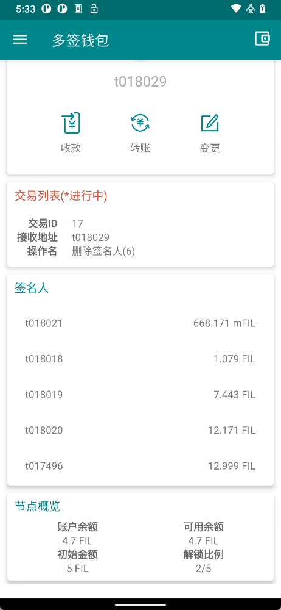
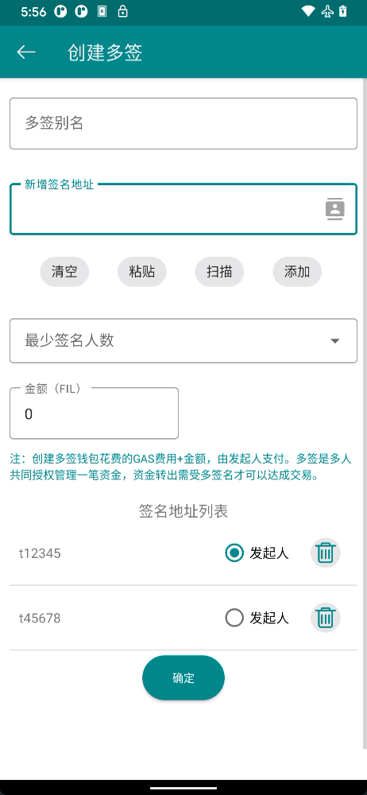
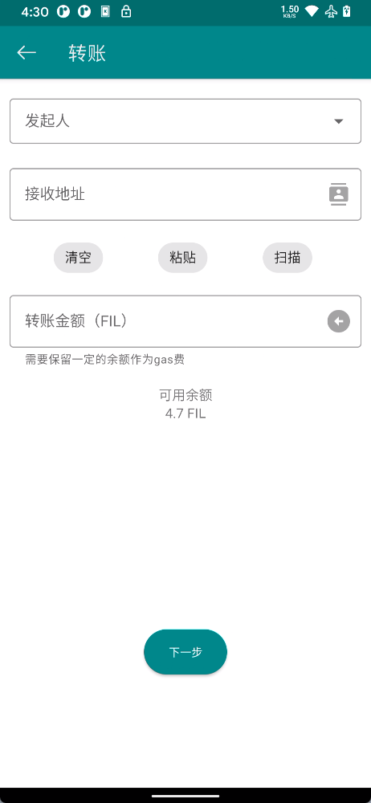
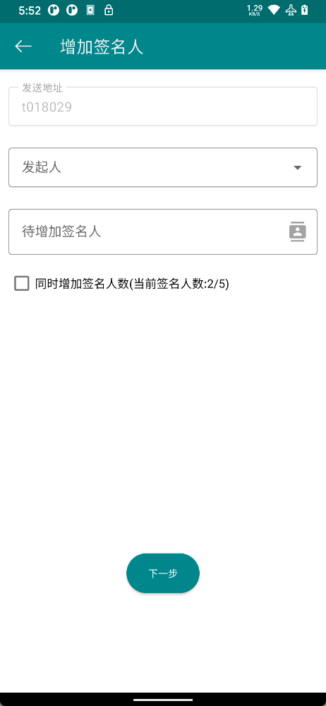
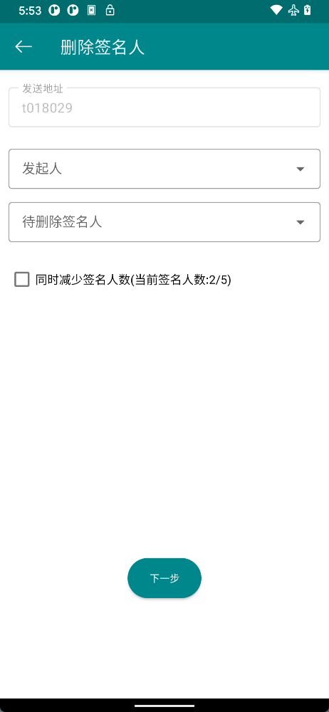
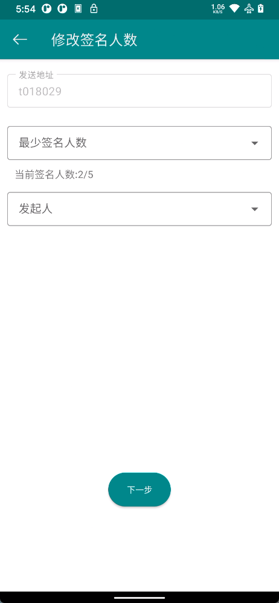

[返回](./README.md)

# 多签功能

多签钱包是指多人共同管理一笔资金的钱包，形如：2-3，表示共3人共同管理资金，其中2人签名同意即可花费资金。多签适用于机构多人决策资金花费的场景，也适用于家人和朋友之间，共同管理一笔特定基金。

多签钱包包含多个签名人，每个签名人都可以发起交易并对交易进行签名，只有签名人数达到设置的最小人数，交易才会成功。通过使用多签钱包，用户就能够避免由于私钥丢失或被盗所引起的安全性问题。因此，即使其中之一的密钥被盗，资金也将是安全的。

## 多签钱包

- **交易列表（进行中）**：待同意的交易列表，点击可进入选择签名人页面进行签署
- **签名人**：当前钱包所有签名人
- **节点概览**
  - **账户余额**：当前钱包所有余额
  - **可用余额**：当前钱包可用余额
  - **初始金额**：创建钱包时初始转入的金额
  - **解锁比例**：要使操作成功成功需要的最小签名人签署比例

## 创建多签钱包

[video demo](./use_msigcreate.md)

- **多签别名**：将要创建的多签钱包的名称
- **新增签名地址**：需要添加的多签成员地址，点击添加按钮加入签名地址列表
- **最少签名人数**：进行交易时，最少需要多少个签名人进行签名，交易才能成功。
- **金额**：创建多签钱包时，从发起人地址向多签钱包转入的金额。金额最少为0，最多不能大于或等于发起人账户余额（需要一定的gas费）
- **发起人**：创建该多签钱包时，对该创建消息进行签名的账号

在首次进入app，或者进入钱包列表页面，均可以找到创建多签钱包的按钮。
多签钱包需要加入多个签名人，在增加签名地址输入框手动输入或选择签名人（只能选择普通钱包作为签名人）。然后点击添加按钮即可加入该签名人。

::: warning 警告
添加签名人时请一定确认签名地址无误
:::

确认所有消息无误后，即可进入[消息处理](../guide/basic.md#消息处理)的环节。

## 转账

[video demo](./use_msigsend.md)

- **发起人**：使用多签钱包转账时
- **接收地址**： 收款人地址
- **转账金额**：转账金额，单位为FIL

对于多签钱包，您还需要额外选择您的签名人地址，用于发起转账请求。在转账请求发送成功后，如果您拥有多个签名人私钥，您可以切换到多签钱包或者对应签名人的钱包，选择交易列表中的未完成操作继续进行签名。

::: tip 注意
多签转账时需要扣除发起人gas费用，请确保发起人钱包有余额
:::

点击下一步，即可进入[消息处理](../guide/basic.md#消息处理)环节。

## 添加签名人

点击多签钱包页面的变更按钮，可以选择添加、删除签名人或修改签名人数。

发起人是对发起变更消息签名的账号，待增加签名人只能选择已经导入的普通钱包地址

增加签名人同时还可以选择对签名人数进行增加，如2/3签名比例，增加后会变为3/4

点击下一步，即可进入[消息处理](../guide/basic.md#消息处理)环节。

## 删除签名人

如果某个签名人密钥丢失，或者你需要将其踢出，可以选择删除签名人。

发起人是对发起变更消息签名的账号，可以和待删除签名人相同。

删除签名人同时还可以选择对签名人数进行减少，如果签名人数比例为100%，则删除签名人后签名人数比例也为100%。

点击下一步，即可进入[消息处理](../guide/basic.md#消息处理)环节。

## 修改签名人数

修改签名人数是修改完成交易需要的最少签名人数。可以修改为(1到签名人总数)中间的任意整数。

点击下一步，即可进入[消息处理](../guide/basic.md#消息处理)环节。
