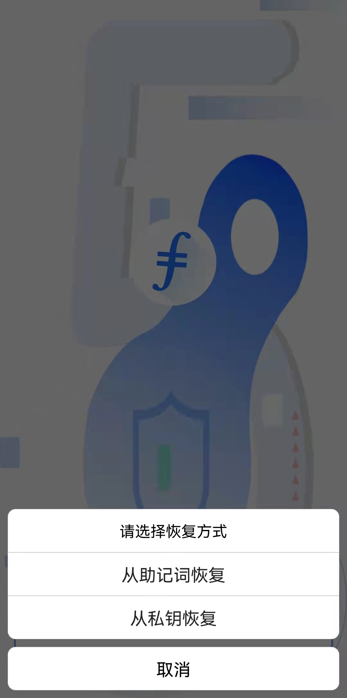
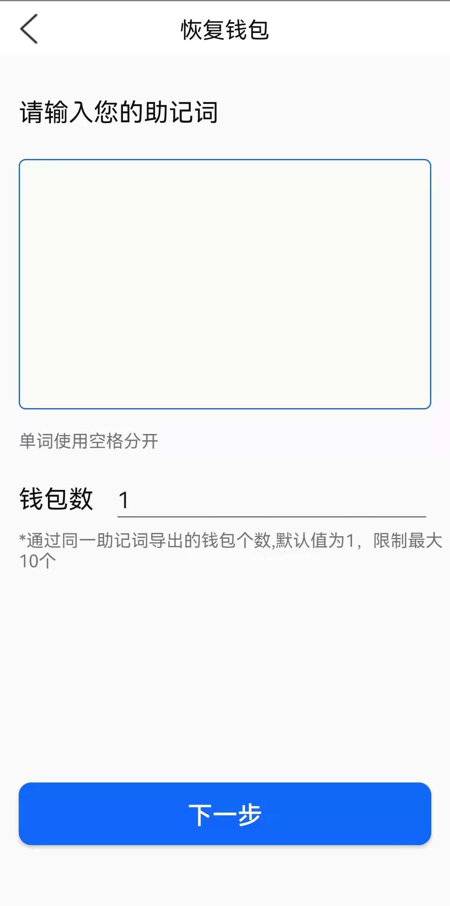
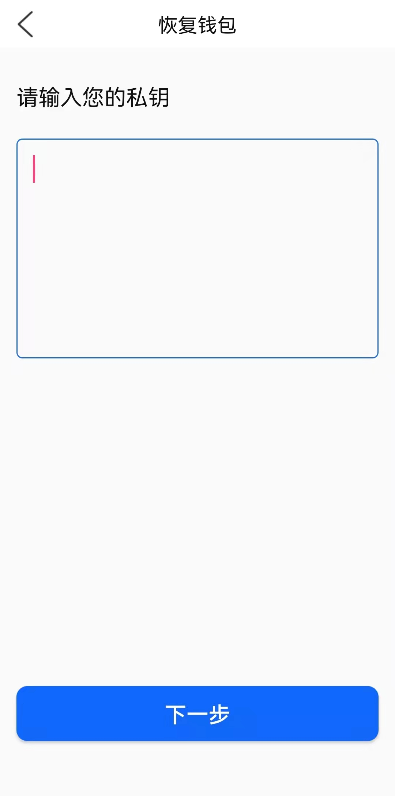

# 导入钱包

- 桌面上点击“imFIL冷钱包”，进入图1
- 点击“恢复钱包”，进入图2
- 图2，点击“从助记词恢复”，进入图3
- 将助记词正确输入到图3文本框中；钱包数默认值为1，修改它可以从同助记词导出多个钱包地址，钱包个数最大值为10。点击“下一步”，完成导入
- 图2，点击“从私钥恢复”，进入图4
- 将私钥正确输入到图4文本框中，点击“下一步”，完成导入
- ***注意：通过私钥导入时，不支持f3地址（BLS钱包）**