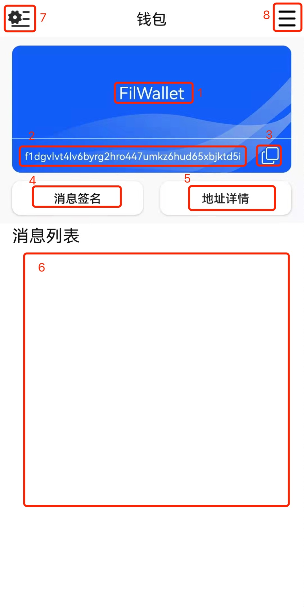

# 钱包详情

- 图一标1，为钱包的备注名称，长按后可以修改备注名称
- 图一标2，为钱包地址
- 图一标3，复制按钮，点击后复制钱包地址
- 图一标4，点击进入“消息签名”页面，启动二维码扫描（图二），具体使用见[使用场景](use_send.md)
- 图一标5，点击进图三地址详情，二维码内容为钱包地址
- 图一标6，展示通过当前钱包进行签名消息后的记录，**不代表交易完成**
- 图一标7，点击进入“钱包管理”页面
- 图一标8，点击进入“钱包列表”页面

