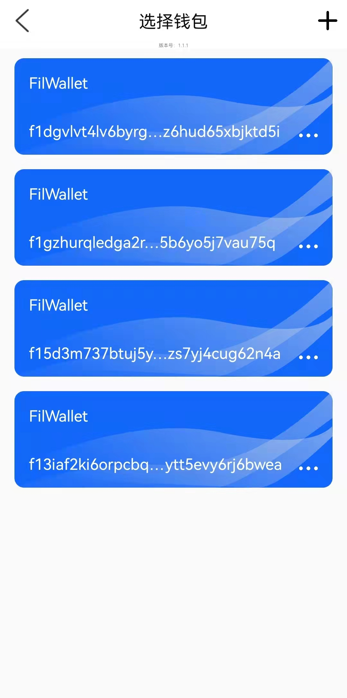
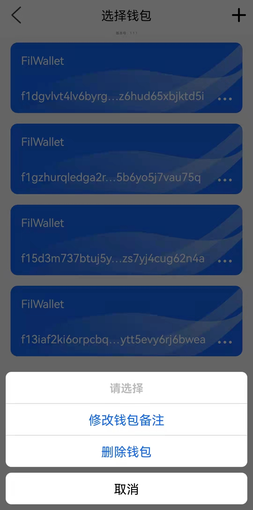
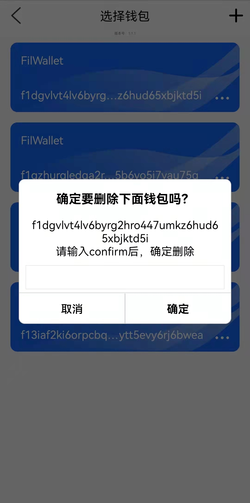
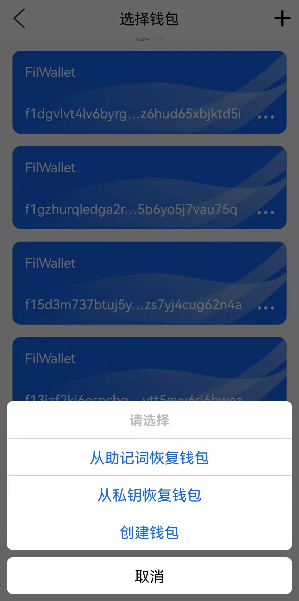

[返回](./README.md)

# 钱包列表

- **删除钱包：** 图一，点击钱包卡片的“...”，弹出对话框（图二），选择“删除钱包”，弹出确认对话框（图三）输入“confirm”关键字后，才能删除钱包。**该功能建议不使用，一旦删除成功，仅能能通过用户自己记录的私钥或助记词进行恢复；一旦用户遗忘私钥和助记词将无法找回删除的钱包**
- **新增钱包：** 图一，点击右上角，弹出选择框（图四），[导入钱包](off_import.md)，[创建钱包](off_create.md)
- **选择钱包：** 图一，点击钱包卡片，设置卡片钱包为当前选中钱包，并跳转到[钱包详情](off_walletinfo.md)